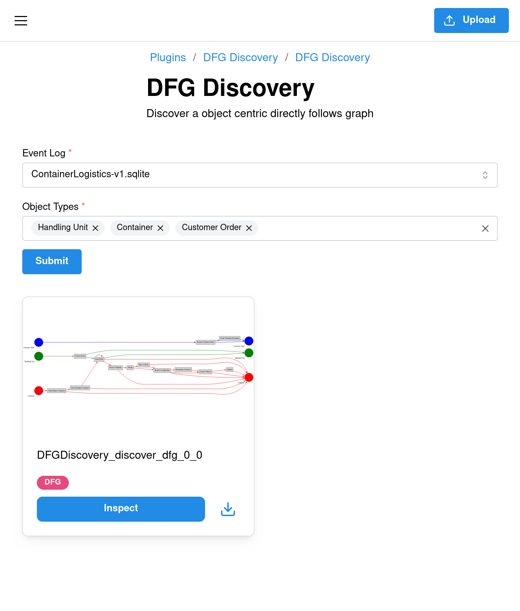

# Plugin Evaluation

In this evaluation, you will integrate a process mining implementation into Ocelescope by creating a plugin.  
The goal is to create a new plugin using the existing Ocelescope system and its documentation.

Let’s say you have already written two Python functions:

1. A **discovery function** that discovers an *object-centric directly-follows graph (OC-DFG)* from an Object-Centric Event Log (OCEL).  
   It returns a list of tuples in the form  `(activity_1, object_type, activity_2)`,  where each tuple means that `activity_2` directly follows `activity_1`, for the given `object_type`.  
   Start and end activities use `None` to indicate the absence of a preceding or following activity.

    !!! example "Example Output of discover_dfg"

        <figure markdown="span">
          {width="50%"}
          <figcaption align="center">
          Visualization of a possible output from <code>discover_dfg</code>:<br>
        [(None, Order, Create Order), (Create Order, Order, Pack Item), (Pack Item, Order, Ship Order), (Ship Order, Order, None), (None, Item, Pack Item), (Pack Item, Item, None)].
          </figcaption>
        </figure>

2. A **visualization function** that creates and returns a Graphviz `Digraph` instance representing the DFG, which can later be used to generate images.

??? "The Discovery and Visualization Functions"

    You don’t need to fully understand the implementation of these functions to complete this evaluation. They are provided as ready-to-use helpers that you will later integrate into your Ocelescope plugin.

    ```python title="util.py"
    from ocelescope import OCEL
    from graphviz import Digraph

    def discover_dfg(ocel: OCEL, used_object_types: list[str]) -> list[tuple[str | None , str, str | None]]:
        import pm4py

        ocel_filtered = pm4py.filter_ocel_object_types(ocel.ocel, used_object_types, positive=True)
        ocdfg = pm4py.discover_ocdfg(ocel_filtered)
        edges :list[tuple[str | None , str, str | None]]= []
        for object_type, raw_edges in ocdfg["edges"]["event_couples"].items():
            edges = edges + ([(source, object_type, target) for source, target in raw_edges])

            edges += [
                (activity, object_type, None)
                for object_type, activities in ocdfg["start_activities"]["events"].items()
                for activity in activities.keys()
            ]

            edges += [
                (None, object_type, activity)
                for object_type, activities in ocdfg["end_activities"]["events"].items()
                for activity in activities.keys()
            ]
        return edges
    
    def convert_dfg_to_graphviz(dfg:list[tuple[str | None,str, str | None]]) -> Digraph:
        from graphviz import Digraph
        import itertools

        dot = Digraph("Ugly DFG")
        dot.attr(rankdir="LR")  
        
        outer_nodes = set()
        inner_sources = {}
        inner_sinks = {}
        edges_seen = set()
        types = set()
        
        for src, x, tgt in dfg:
            if src is not None:
                outer_nodes.add(src)
            if tgt is not None:
                outer_nodes.add(tgt)
            if x is not None:
                types.add(x)
                inner_sources[x] = f"source_{x}"
                inner_sinks[x] = f"sink_{x}"
            edges_seen.add((src, x, tgt))
        
        # A palette of colors
        palette = [
            "red", "blue", "green", "orange", "purple",
            "brown", "gold", "pink", "cyan", "magenta"
        ]
        color_map = {x: c for x, c in zip(sorted(types), itertools.cycle(palette))}
        
        # Outer nodes: neutral color
        for n in outer_nodes:
            dot.node(n, shape="rectangle", style="filled", fillcolor="lightgray")
        
        # Sources and sinks: colored small circles, with xlabel underneath
        for x in types:
            color = color_map[x]
            dot.node(
                inner_sources[x],
                shape="circle",
                style="filled",
                fillcolor=color,
                width="1",
                height="1",
                fixedsize="true",
                label="",
                xlabel=x
            )
            dot.node(
                inner_sinks[x],
                shape="circle",
                style="filled",
                fillcolor=color,
                width="1",
                height="1",
                label="",
                fixedsize="true",
                xlabel=x
            )
        
        # Rank groups
        with dot.subgraph() as s:
            s.attr(rank="same")
            for n in inner_sources.values():
                s.node(n)
        
        with dot.subgraph() as s:
            s.attr(rank="same")
            for n in inner_sinks.values():
                s.node(n)
        
        # Add edges with thicker lines
        for src, x, tgt in edges_seen:
            if x is None:
                continue
            color = color_map[x]
            if src is not None and tgt is not None:
                dot.edge(src, tgt, color=color, penwidth="2")
            elif src is None and tgt is not None:
                dot.edge(tgt, inner_sinks[x], color=color, penwidth="2")
            elif src is not None and tgt is None:
                dot.edge(src, inner_sources[x], color=color, penwidth="2")
        
        return dot
    ```
At the end of this evaluation, you should have a **working plugin** that looks like this:

<figure markdown="span">
  {width="50%"}
  <figcaption align="center">Example of a completed OC-DFG discovery plugin in Ocelescope.</figcaption>
</figure>

For additional context or examples, you can use the [**Plugin Development Guide**](../plugins/index.md){target="_blank"} and the [**Tutorial**](../plugins/tutorial.md){target="_blank"}.  
Everything you need to complete this evaluation is included here, but if you're curious and want to explore the topic further, those guides provide a deeper look into plugin development in Ocelescope.

## Step 1: Crash course in Ocelescope

Before we start building our plugin, let's take a quick look at the main building blocks of an Ocelescope plugin.
Understanding these core components will make the next implementation steps much easier to follow.

### Plugin Class

An **Ocelescope plugin** is a collection of Python functions grouped inside a class that inherits from the base `Plugin` class provided by the `ocelescope` package.

Each plugin includes basic **metadata**, such as its name, version, and description, defined as class variables.
Individual functions within the plugin are defined as **plugin methods**, which use the `@plugin_method` decorator to attach their own labels and descriptions.

<figure markdown="span">
  
  <figcaption align="center">Example of an Ocelescope plugin in code and in the app.</figcaption>
</figure>

### Resources

Resources are Python classes that can be used as inputs and outputs of plugin methods.
They can represent process models, results of performance analyses, or any other structured data.

Resources returned by plugin methods are automatically saved and can be reused as inputs for other methods.
A resource is defined as a Python class that inherits from the `Resource` base class provided by the `ocelescope` package.

Optionally, a resource can also implement a visualization function, which is a method that returns an instance of one of the predefined visualization types, such as Table, Graph (an interactive graph), or DotVis (a Graphviz-based visualization).

<figure markdown="span">
  
  <figcaption align="center">A resource used to store activity counts. On the left its Python implementation; on the right, its visualization in Ocelescope.</figcaption>
</figure>

### Plugin Methods

As discussed earlier, plugin methods are functions defined inside a plugin class.
Their input parameters automatically generate a corresponding form in the Ocelescope frontend.

A plugin method can have any number of parameters of type `OCEL` or `Resource`.
In addition it can include one plugin input parameter, which is defined by creating a custom class that inherits from the `PluginInput` base class provided by the `ocelescope` package.

You can also define special *OCEL-dependent fields* within the same class.
These fields are linked to a specific `OCEL` parameter of your plugin method through the `ocel_id` reference in the `OCEL_FIELD` helper.

<figure markdown="span">
  
  <figcaption align="center">A plugin method with its custom input class. On the left is the Python code, and on the right is the automatically generated form in Ocelescope.</figcaption>
</figure>

!!! warning "Match `ocel_id` with the Method Parameter"

    The ocel_id defined in each OCEL-dependent field must exactly match the name of the OCEL parameter in your plugin method.
    This ensures the field is correctly linked to the selected OCEL log.
    ```python title="Example"
    class ExampleInput(PluginInput):
        object_types: str = OCEL_FIELD(
            title="Object Type",
            description="Select which object types to include",
            field_type="object_type",
            ocel_id="ocel"  # Must match the method parameter below
        )

    class ExamplePlugin(Plugin):
        @plugin_method(label="Filter by Object Type")
        def filter_by_object_type(self, ocel: OCEL, input: ExampleInput):
            ...
    ```

## Step 2: Setup

Let's start by setting up the minimal Ocelescope plugin template.  
You can choose one of the following two methods to prepare your project.

### Option A - Clone the Template from GitHub

Clone the minimal plugin template directly from [:simple-github: Github (link to the repository)](https://github.com/Grkmr/Minimal-Ocelescope-Plugin-Template){target="_blank"}:

```bash
git clone https://github.com/Grkmr/Minimal-Ocelescope-Plugin-Template.git
cd Minimal-Ocelescope-Plugin-Template
```

### Option B - Generate a New Project with Cookiecutter

Alternatively, you can generate a new plugin project using Cookiecutter through uv:

!!! warning

    When running the Cookiecutter template, always use the default options (press **:material-keyboard-return: Enter** for each prompt).
    This ensures the generated project matches the structure expected in this evaluation.

```bash linenums="0"
uvx cookiecutter gh:rwth-pads/ocelescope --directory template
```

When you’ve completed the setup steps above, your project directory should look similar to this:

```linenums="0"
minimal-plugin/ <- root
├─ LICENSE
├─ README.md
├─ pyproject.toml
├─ requirements.txt
├─ src/
│  ├─ minimal_plugin/
│  │  ├─ __init__.py
│  │  ├─ plugin.py
```

### Install Dependencies

Navigate to the root of the project and install all dependencies using your preferred package manager.

???+ warning

    This evaluation requires **Python 3.13**. Make sure you have it installed 
    before continuing.

!!! example

    ```sh
    # With uv
    uv sync

    # Or with pip
    pip install -r requirements.txt
    ```

## Step 3: Implement the Plugin

After setting up the project and becoming familiar with how Ocelescope plugins work, we will now implement our first real plugin: a discovery plugin for object-centric directly-follows graph (OC-DFGs), as introduced earlier.

The plugin will have the following components:

**Inputs**

- An **OCEL** log  
- A **list of object types** to include in the discovery  

**Outputs**

- A custom **OC-DFG** [**Resource**](../plugins/resource.md){target="_blank"} containing the discovered directly-follows graph  

### Step 3.1 Prepare the Template

The plugin template we set up earlier provides a `plugin.py` file that already includes boilerplate code for a minimal Ocelescope plugin.
It contains a plugin class, a resource, and an input class.

!!! note "Initial state of `plugin.py`"

    ```python
    from typing import Annotated

    from ocelescope import OCEL, OCELAnnotation, Plugin, PluginInput, Resource, plugin_method

    class MinimalResource(Resource):
        label = "Minimal Resource"
        description = "A minimal resource"

        def visualize(self) -> None:
            pass

    class Input(PluginInput):
        pass

    class MinimalPlugin(Plugin):
        label = "Minimal Plugin"
        description = "An Ocelescope plugin"
        version = "0.1.0"

        @plugin_method(label="Example Method", description="An example plugin method")
        def example(
            self,
            ocel: Annotated[OCEL, OCELAnnotation(label="Event Log")],
            input: Input,
        ) -> MinimalResource:
            return MinimalResource()
    ```

#### Rename the Plugin Class

1. Rename the class `MinimalPlugin` to a meaningful name, for example `DiscoverDFG`.  
2. Update the `label` and `description` fields to describe the new plugin.  
3. Adapt the import in `__init__.py` to reflect the new class name.  

???+ tip

    The Ocelescope app looks inside the `__init__.py` file to locate your plugin class.  
    Make sure to update both the import and the `__all__` list when renaming your plugin.

    ```python title="__init__.py"
    from .plugin import MinimalPlugin  # Rename this

    __all__ = [
        "MinimalPlugin",  # Rename this
    ]
    ```

#### Rename the Plugin Method

1. Rename the method `example` to a descriptive name, for example `discover`.  
1. Update the method’s `label` and `description` fields to describe its purpose.  

#### Rename the Resource

1. Rename the class `MinimalResource` to `DFG`.  
1. Update the `label` and `description` to indicate that the resource represents an object-centric directly-follows graph.

#### Add the Utility File

To keep your plugin code clean and organized, we will place the discovery and visualization functions in a separate file named `util.py`.

You can either **download** the ready-made [:material-download: util.py](../assets/util.py){download="util.py"} file and place it next to your `plugin.py`,  
or **create** a new `util.py` file in the same directory and **paste** the implementation below.

??? "The Discovery and Visualization implementation"

    You don’t need to fully understand the implementation of these functions to complete this evaluation. They are provided as ready-to-use helpers that you will later integrate into your Ocelescope plugin.

    ```python title="util.py"
    from ocelescope import OCEL
    from graphviz import Digraph

    def discover_dfg(ocel: OCEL, used_object_types: list[str]) -> list[tuple[str | None , str, str | None]]:
        import pm4py

        ocel_filtered = pm4py.filter_ocel_object_types(ocel.ocel, used_object_types, positive=True)
        ocdfg = pm4py.discover_ocdfg(ocel_filtered)
        edges :list[tuple[str | None , str, str | None]]= []
        for object_type, raw_edges in ocdfg["edges"]["event_couples"].items():
            edges = edges + ([(source, object_type, target) for source, target in raw_edges])

            edges += [
                (activity, object_type, None)
                for object_type, activities in ocdfg["start_activities"]["events"].items()
                for activity in activities.keys()
            ]

            edges += [
                (None, object_type, activity)
                for object_type, activities in ocdfg["end_activities"]["events"].items()
                for activity in activities.keys()
            ]
        return edges
    
    def convert_dfg_to_graphviz(dfg:list[tuple[str | None,str, str | None]]) -> Digraph:
        from graphviz import Digraph
        import itertools

        dot = Digraph("Ugly DFG")
        dot.attr(rankdir="LR")  
        
        outer_nodes = set()
        inner_sources = {}
        inner_sinks = {}
        edges_seen = set()
        types = set()
        
        for src, x, tgt in dfg:
            if src is not None:
                outer_nodes.add(src)
            if tgt is not None:
                outer_nodes.add(tgt)
            if x is not None:
                types.add(x)
                inner_sources[x] = f"source_{x}"
                inner_sinks[x] = f"sink_{x}"
            edges_seen.add((src, x, tgt))
        
        # A palette of colors
        palette = [
            "red", "blue", "green", "orange", "purple",
            "brown", "gold", "pink", "cyan", "magenta"
        ]
        color_map = {x: c for x, c in zip(sorted(types), itertools.cycle(palette))}
        
        # Outer nodes: neutral color
        for n in outer_nodes:
            dot.node(n, shape="rectangle", style="filled", fillcolor="lightgray")
        
        # Sources and sinks: colored small circles, with xlabel underneath
        for x in types:
            color = color_map[x]
            dot.node(
                inner_sources[x],
                shape="circle",
                style="filled",
                fillcolor=color,
                width="1",
                height="1",
                fixedsize="true",
                label="",
                xlabel=x
            )
            dot.node(
                inner_sinks[x],
                shape="circle",
                style="filled",
                fillcolor=color,
                width="1",
                height="1",
                label="",
                fixedsize="true",
                xlabel=x
            )
        
        # Rank groups
        with dot.subgraph() as s:
            s.attr(rank="same")
            for n in inner_sources.values():
                s.node(n)
        
        with dot.subgraph() as s:
            s.attr(rank="same")
            for n in inner_sinks.values():
                s.node(n)
        
        # Add edges with thicker lines
        for src, x, tgt in edges_seen:
            if x is None:
                continue
            color = color_map[x]
            if src is not None and tgt is not None:
                dot.edge(src, tgt, color=color, penwidth="2")
            elif src is None and tgt is not None:
                dot.edge(tgt, inner_sinks[x], color=color, penwidth="2")
            elif src is not None and tgt is None:
                dot.edge(src, inner_sources[x], color=color, penwidth="2")
        
        return dot
    ```

After completing the previous steps, your project structure should look like this:

``` linenums="0"
minimal-plugin/
├─ ...
├─ src/
│  ├─ minimal_plugin/
│  │  ├─ __init__.py
│  │  ├─ plugin.py
│  │  ├─ util.py
```

<span id="relative-imports"></span>
!!! warning "Use only relative imports"

    Ocelescope plugins must use **relative imports** when referencing files within the same package.

    ```python
    from minimal_plugin.util import discover_dfg  # ❌ Do not use absolute imports
    from util import discover_dfg                 # ❌ Do not use top-level imports
    from .util import discover_dfg                # ✅ Use relative imports instead  
    ```
    
### Step 3.2 Integrate the Discovery Functions

Now that the structure is in place, we can integrate the discovery and visualization functions into the plugin to make it functional.

#### Extend the Resource

Since our plugin returns a directly-follows graph, we should add an `edges` field (class attribute) to our DFG resource to store the discovered relationship.

The discovery method provided in the `util.py` returns the OC-DFG as a list of triplets `discover_dfg(...) -> list[tuple[str | None , str, str | None]]`.
To integrate this into our Resource, extend your `DFG` to hold this data.

1. Add a field (class attribute) named `edges` with the following type:

  ```python linenums="0"
    list[tuple[str | None, str, str | None]]
  ```

#### Add a visualization to the Resource

Our `DFG` resource can already be used as both an input and an output, but right now it only stores data without any visual representation.

To display it visually in the Ocelescope frontend, we can extend its `visualize` method.

The provided `util.py` file already includes a helper function,
`convert_dfg_to_graphviz`, which takes the resource's `edges` as input and returns a `graphviz.Digraph` instance.

Ocelescope supports several visualization types, including `DotVis`, which renders Graphviz DOT strings.

A `DotVis` instance can also be created directly from a `graphviz.Digraph` by using `DotVis.from_graphviz(...)`.

Inside the `visualize` method of your `DFG` resource:

  1. Import the `convert_dfg_to_graphviz` from the `util.py` as a [*relative import*](#relative-imports)
  1. Call the `convert_dfg_to_graphviz` with the resource's `edges` field.
  1. Return a `DotVis` instance created with `DotVis.from_graphviz(...)`.

!!! tip
  
    You can access the edges through `self.edges`, assuming the field in your `DFG` resource is named `edges`.

#### Extend the Input Class

Now let's define the input of the `discover` function.
Since we renamed the original example method inside the plugin class, it should already include an OCEL parameter named `ocel`.

Because the discovery function allows filtering by object type, we should also allow the user to select which object types to include. This is done by extending the `PluginInput` class.

Inside the `Input` class (which inherits from `PluginInput`):

  1. Remove the existing `pass` statement.
  2. Add a new field (class attribute) called `object_types` with the type `list[str]`
  3. Turn it into an OCEL-dependent field using the `OCEL_FIELD` helper, setting the `field_type` to `"object_type"`

#### Integrate the Implementation

After defining the inputs for our discovery and the `Resource` that will hold the result, we can now connect everything in the `discover` method of our plugin class.

In the `discover` method:

  1. Import the `discover_dfg` function as a [*relative import*](#relative-imports).
  1. Call the `discover_dfg` with the `ocel` parameter and the `object_types` field from the input class, then use the result to create a new instance of the `DFG` resource.
  1. Return the created `DFG` resource

!!! tip
  
    You can access the selected object types through `input.object_types`, assuming the field in your `Input` class is named `object_types`.

## Step 4: Build your plugin

That's it! The final step is to build your plugin. You can do this in one of two ways:

1. **Manually**, by creating a ZIP archive yourself:

    ```text linenums="0"
    minimal_plugin.zip/
    ├─ __init__.py
    ├─ plugin.py
    ├─ util.py
    ```

2. **Using the built-in Ocelescope build command** (recommended):

    Run the build command in the root of your project.

    Make sure to execute it within the same Python environment where you installed your dependencies.

    ```sh linenums="0"
    ocelescope build
    ```

    Or, depending on how you manage your environment:

    ```sh linenums="0"
    # If using pipx
    pipx run ocelescope build

    # If using uvx
    uvx ocelescope build

    # If using uv
    uv run ocelescope build
    ```

    !!! note

        The Ocelescope CLI is automatically available if you installed the project dependencies earlier.

After building, you'll find your packaged plugin as a `.zip` file inside the `dist/` directory.

If you'd like, you can upload the ZIP file in the Ocelescope interface to test your plugin directly.

Once finished, return to the evaluation form to complete your assessment.
