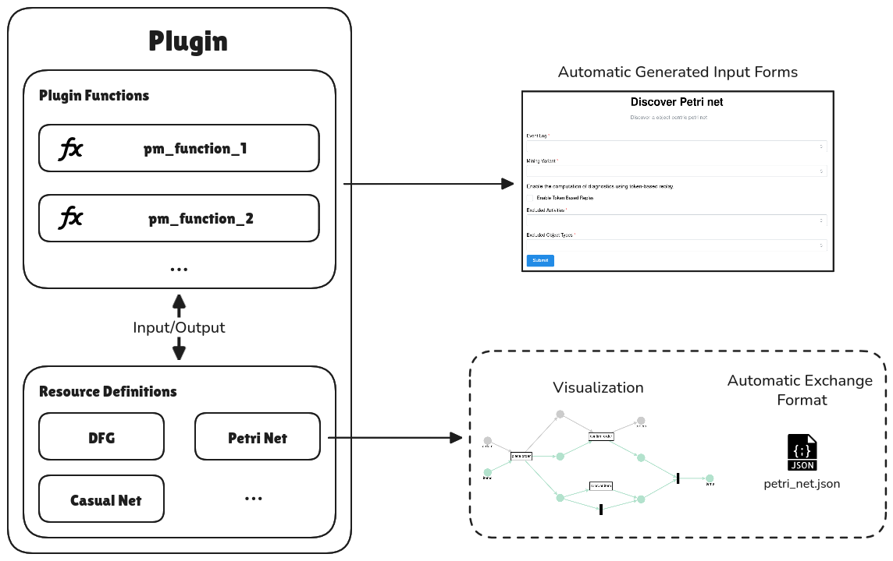

# Overview

Plugins in **Ocelescope** are collections of object-centric process mining functions and artifacts.  
They are designed to wrap research prototypes and provide them with a unified environment.  
The plugin system aims to require as little additional knowledge as possible, making it easy to integrate new ideas and tools.

Using the Ocelescope plugin system has several advantages:

- **Resource definitions** automatically generate a JSON-based exchange format for the artifacts they describe.
- **Built-in visualization support** allows resources to be rendered using a variety of visualization data structures.
- **Process mining functions** define their inputs declaratively, which enables automatic generation of user input forms.

<figure markdown="span">
  {width="600"}
  <figcaption align="center">Overview of Plugins in Ocelescope</figcaption>
</figure>

This guide introduces all the concepts you need to write plugins for Ocelescope.  
For a hands-on walkthrough, see the [**Tutorial**](tutorial.md).
