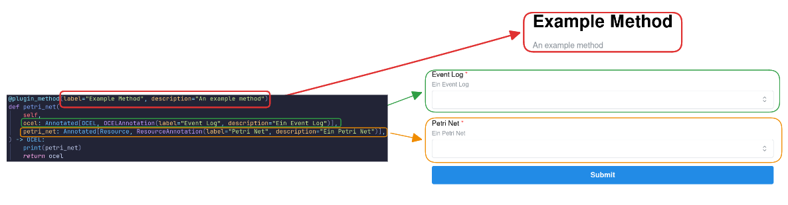

# Plugin Class

Plugins are defined by a **single plugin class** that inherits from the `Plugin` base class provided by the Ocelescope Python package.

A plugin class contains:

- **Metadata** (e.g., label, description, version) that is displayed in the frontend’s plugin interface.
- **Runnable functions** (plugin methods) that can be invoked from within Ocelescope.

<figure markdown="span">
  
  <figcaption align="center">Example of an Ocelescope plugin in code and in the app.</figcaption>
</figure>

Each plugin package must export **exactly one** plugin class via its `__init__.py`.

!!! example "An example plugin"
    ```py title="plugin.py"
    from ocelescope import OCEL, PetriNet, Plugin, plugin_method

    class DiscoveryPlugin(Plugin):
        label = "Discovery Plugin"
        description = "An Ocelescope plugin"
        version = "1.0.0"

        @plugin_method(
            label="Discover Petri Net",
            description="Discover an object-centric Petri net",
        )
        def discover_ocpn(self, ocel: OCEL) -> PetriNet: ...
    ```

    ```py title="__init__.py"
    from .plugin import DiscoveryPlugin

    __all__ = [
        "DiscoveryPlugin",
    ]
    ```

## Functions

Functions in Ocelescope are **object-centric process mining (OCPM)** operations. They consume and produce:

- **OCELs** (`OCEL`), and/or  
- **OCPM artifacts**, exposed in Ocelescope as **resources** (e.g., `PetriNet`, custom resource types).

Functions are defined as **methods on the plugin class** and must be decorated with `@plugin_method`.  
The **function signature** defines the interface:

- **Inputs** are derived from the method parameters (type annotations determine expected resource types).
- **Outputs** are derived from the return type annotation (including collections such as `list[Variant]`).

```py title="Some example plugin methods"
from ocelescope import OCEL, PetriNet, Plugin, plugin_method

from .custom_resources import ConformanceResult, Variant


class DiscoveryPlugin(Plugin):
    ...

    @plugin_method(
        label="Discover Petri Net",
        description="Discover an object-centric Petri net",
    )
    def discover_ocpn(self, ocel: OCEL) -> PetriNet: ...

    @plugin_method(
        label="Discover Variants",
        description="Discover variants",
    )
    def discover_olpm(self, ocel: OCEL) -> list[Variant]: ...

    @plugin_method(
        label="Alignment-based Conformance",
        description="Compute alignment-based conformance",
    )
    def conformance_alignment(
        self,
        petri_net: PetriNet,
        variants: list[Variant],
    ) -> ConformanceResult: ...
```

The function definitions (decorator metadata, parameter types, and return types) are used to **automatically generate an input form** in the frontend.

!!! tip "Metadata"
    In addition to the `@plugin_method` metadata, you can annotate input parameters with
    `ResourceAnnotation` and `OCELAnnotation` from the Ocelescope package to provide extra context—such as a **human-readable title** or **description**—for the function and its inputs.

    <figure markdown="span">
      
    </figure>
