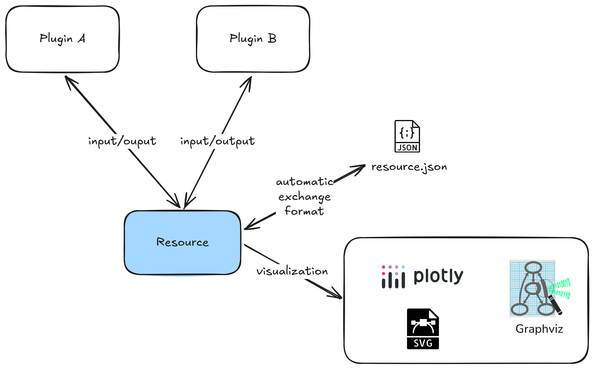

# Resources

Resources are the main mechanism to define **inputs** and **outputs** of Ocelescope plugin methods.

When you define a resource, it becomes **exportable** and **importable** by default through an automatic exchange format.

Resources can also provide a visualization so they can be displayed in the frontend.

<figure markdown="span">
  {width="600"}
</figure>

## Defining a resource

Define a resource by creating a Python class that inherits from `Resource` (from the `ocelescope` package). The structure of the resource is described through typed fields on the class. You can also set `label` and `description` to control how the resource appears in the frontend.

If you want to reuse a resource across plugins, keep the **class name** and the **field definitions** identical.

```python title="Example: defining a resource"
from ocelescope import Resource

class Example(Resource):
    label = "Example Resource"
    description = "An example resource definition"

    property_a: str
    property_b: list[int]
```

!!! warning "Resources must be JSON-serializable"
    For import and export to work, a resource must be serializable and instantiable from its serialized form.

    Use standard types like `str`, `int`, `float`, `bool`, `list`, or `dict`, or custom types that are themselves serializable.

    If you use nested classes (for example, a resource that contains nodes and edges), make those nested classes Pydantic models (inherit from `pydantic.BaseModel`) so they can be validated and serialized consistently.

    ```python
    from pydantic import BaseModel
    from ocelescope import Resource

    class Node(BaseModel):
        id: str
        label: str

    class Edge(BaseModel):
        source: str
        target: str
        label: str | None = None

    class GraphResource(Resource):
        nodes: list[Node]
        edges: list[Edge]

    # Quick round-trip check (serialize -> create again)
    GraphResource(
        GraphResource(
            nodes=[Node(id="n1", label="Start"), Node(id="n2", label="End")],
            edges=[Edge(source="n1", target="n2", label="go")]
        ).model_dump()
    )
    ```

## Visualization

Visualizations in **Ocelescope** allow resources to render themselves in the frontend using predefined visualization types such as graphs, SVGs, and tables.

To enable visualization for a resource, implement the `visualize()` method in your `Resource` subclass. This method should return one of the supported visualization objects described below.

### Supported Visualization Types

#### Graph

A **graph visualization model** composed of nodes and directed edges.
Commonly used for **Petri nets**, **directly-follows graphs**, and other graph-based models.
Layout and rendering are powered by **Graphviz**.

---

### **Classes**

- `Graph`
- `GraphNode`
- `GraphEdge`
- `GraphvizLayoutConfig`

---

### **GraphNode**

Defines a **visual node** in the graph.

| Field          | Type                                                               | Description                                                                        |
| -------------- | ------------------------------------------------------------------ | ---------------------------------------------------------------------------------- |
| `id`           | `str`                                                              | Unique node ID (UUID string, auto-generated)                                       |
| `label`          | `str | None`                                                       | Display label for the node                                                         |
| `shape`        | `Literal["circle", "triangle", "rectangle", "diamond", "hexagon"]` | Node shape                                                                         |
| `width`          | `float | None`                                                     | Node width in pixels                                                               |
| `height`         | `float | None`                                                     | Node height in pixels                                                              |
| `color`          | `str | None`                                                       | Fill color (hex or named color)                                                    |
| `x`              | `float | None`                                                     | X-coordinate after layout (auto-set)                                               |
| `y`              | `float | None`                                                     | Y-coordinate after layout (auto-set)                                               |
| `border_color`   | `str | None`                                                       | Border (stroke) color                                                              |
| `label_pos`    | `Literal["top", "center", "bottom"]`                               | Label position relative to node (default: `"bottom"`)                              |
| `rank`           | `Literal["source", "sink"] | int | None`                             | Optional rank constraint for layout (e.g., `"source"`, `"sink"`, or numeric level) |
| `layout_attrs` | `dict[str, str | int | float | bool] | None`                   | Additional Graphviz attributes for this node                                       |

---

### **GraphEdge**

Represents a **directed connection** between two nodes.

| Field          | Type                                             | Description                                          |
| -------------- | ------------------------------------------------ | ---------------------------------------------------- |
| `id`           | `str`                                            | Unique edge ID (UUID string, auto-generated)         |
| `source`       | `str`                                            | Source node ID                                       |
| `target`       | `str`                                            | Target node ID                                       |
| `color`        | `str | None`                                    | Edge color                                           |
| `label`        | `str | None`                                    | Label text displayed along the edge                  |
| `start_arrow`  | `EdgeArrow`                                      | Arrowhead at the start of the edge (default: `None`) |
| `end_arrow`    | `EdgeArrow`                                      | Arrowhead at the end of the edge (default: `None`)   |
| `start_label`  | `str | None`                                    | Label near the source end                            |
| `end_label`    | `str | None`                                    | Label near the target end                            |
| `layout_attrs` | `dict[str, str | int | float | bool] | None` | Additional Graphviz attributes for this edge         |
| `annotation`   | `Visualization | None`                          | Optional annotation attached to the edge             |

#### **EdgeArrow**

Supported arrowhead styles:

```
"triangle" | "circle-triangle" | "triangle-backcurve" | "tee" | "circle" |
"chevron" | "triangle-tee" | "triangle-cross" | "vee" | "square" | "diamond" | None
```

---

### **GraphvizLayoutConfig**

Specifies **Graphviz layout engine and default attributes** for rendering.

| Field        | Type                                             | Description                                                               |
| ------------ | ------------------------------------------------ | ------------------------------------------------------------------------- |
| `engine`     | `GraphVizLayoutingEngine`                        | Graphviz engine (`dot`, `neato`, `fdp`, `sfdp`, etc.)                     |
| `graphAttrs` | `dict[str, str | int | float | bool] | None` | Global graph attributes (e.g., `rankdir`, `splines`, `size`)              |
| `nodeAttrs`  | `dict[str, str | int | float | bool] | None` | Default attributes for all nodes (e.g., `shape`, `color`, `fontsize`)     |
| `edgeAttrs`  | `dict[str, str | int | float | bool] | None` | Default attributes for all edges (e.g., `arrowsize`, `color`, `penwidth`) |

---

### **Graph**

Main graph visualization container.

| Field           | Type                   | Description                   |
| --------------- | ---------------------- | ----------------------------- |
| `type`          | `Literal["graph"]`     | Fixed type identifier         |
| `nodes`         | `list[GraphNode]`      | List of graph nodes           |
| `edges`         | `list[GraphEdge]`      | List of graph edges           |
| `layout_config` | `GraphvizLayoutConfig` | Graphviz layout configuration |

---

### **Example Usage**

```python
from ocelescope.visualization.graph import (
    Graph, GraphNode, GraphEdge, GraphvizLayoutConfig
)

graph = Graph(
    nodes=[
        GraphNode(label="Start", shape="circle", color="green", rank="source"),
        GraphNode(label="End", shape="rectangle", color="red", rank="sink"),
    ],
    edges=[
        GraphEdge(
            source="n1",
            target="n2",
            label="Transition",
            color="gray",
            start_arrow=None,
            end_arrow="triangle"
        )
    ],
    layout_config=GraphvizLayoutConfig(
        engine="dot",
        graphAttrs={
            "rankdir": "LR",  # Layout direction: Left to Right
            "nodesep": 0.5,
            "ranksep": 0.5
        },
        nodeAttrs={
            "shape": "circle",
            "fontsize": 12
        },
        edgeAttrs={
            "arrowsize": 0.8,
            "color": "gray"
        }
    )
)
```

Graphviz automatically determines node coordinates (`x`, `y`) and dimensions (`width`, `height`) based on the chosen layout engine and attributes.

---

#### SVG

Use raw SVG markup when a graph-based layout is not appropriate, or when you need full control over visuals.

- **Class**: `SVGVis`
- **Use case**: Custom layouts, charts, icons, or any visualization expressible as SVG.

**Example**

```python
from ocelescope.visualization.default.svg import SVGVis

class MyRawSVGResource(Resource):
    def visualize(self):
        svg = """
        <svg xmlns='http://www.w3.org/2000/svg' width='200' height='100'>
            <circle cx='50' cy='50' r='40' fill='#ffcc00'/>
            <text x='50' y='55' text-anchor='middle' font-size='14'>Hello</text>
        </svg>
        """
        return SVGVis(type="svg", svg=svg)
```

---

#### Table

A structured table with typed columns and customizable rows. Ideal for datasets, summaries, or event logs.

- **Class**: `Table`
- **Column Class**: `TableColumn`
- **Supported Column Types**: `string`, `number`, `boolean`, `date`, `datetime`

```python
from ocelescope.visualization.default.table import Table, TableColumn

class MyTableResource(Resource):
    def visualize(self):
        return Table(
            columns=[
                TableColumn(id="name", label="Name", data_type="string"),
                TableColumn(id="age", label="Age", data_type="number"),
                TableColumn(id="member", label="Is Member", data_type="boolean"),
                TableColumn(id="joined", label="Join Date", data_type="date")
            ],
            rows=[
                {"name": "Alice", "age": 30, "member": True, "joined": "2022-01-15"},
                {"name": "Bob", "age": 25, "member": False, "joined": "2023-06-10"},
                {"name": "Charlie", "age": 40, "member": True, "joined": "2021-09-20"}
            ]
        )
```

The table supports sorting, hiding, and formatting options for each column.

For advanced use cases, you can contribute your own visualization types to the Ocelescope framework

---

#### Dot

A raw Graphviz DOT visualization, preserving the full DOT source string. Useful when you want direct control over Graphviz rendering or need to reuse an existing DOT description.

- **Class**: `DotVis`
- **Layout**: Explicitly set by Graphviz via a chosen layout engine (`dot`, `neato`, `fdp`, etc.)

##### DotVis

| Field           | Type                      | Description                                                              |
| --------------- | ------------------------- | ------------------------------------------------------------------------ |
| `type`          | `Literal["dot"]`          | Identifies the visualization type as DOT                                 |
| `dot_str`       | `str`                     | The raw DOT source string (as produced by `graphviz.Digraph` or `Graph`) |
| `layout_engine` | `GraphVizLayoutingEngine` | The Graphviz engine used (`dot`, `neato`, `fdp`, `sfdp`, `circo`, etc.)  |

##### Supported Layout Engines

| Engine        | Description                                                    |
| ------------- | -------------------------------------------------------------- |
| `dot`         | Hierarchical layouts, suited for layered graphs and flowcharts |
| `neato`       | Spring-model layouts, good for undirected graphs               |
| `fdp`         | Force-directed placement, similar to `neato`                   |
| `sfdp`        | Scalable force-directed placement for large graphs             |
| `circo`       | Circular layouts                                               |
| `twopi`       | Radial layouts (nodes placed in concentric circles)            |
| `osage`       | Clustered layouts                                              |
| `patchwork`   | Treemap-style layouts                                          |
| `nop`, `nop2` | No-op layout engines (use raw input positions if given)        |

##### Constructing from Graphviz

Use `.from_graphviz()` to convert an existing `graphviz.Digraph` or `graphviz.Graph` object into a `DotVis`.

```python
from graphviz import Digraph
from ocelescope.visualization.default.dot import DotVis

class MyDotResource(Resource):
    def visualize(self):
        dot = Digraph()
        dot.node("A", "Start")
        dot.node("B", "End")
        dot.edge("A", "B")

        return DotVis.from_graphviz(
            graph=dot,
            layout_engine="dot"   # or "neato", "circo", etc.
        )
```

The resulting `DotVis` object carries both the DOT source (`dot_str`) and the layout engine specification, allowing full control over Graphviz rendering.
