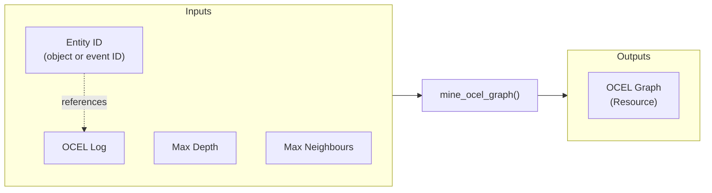

# Tutorial: OCEL Graph

This tutorial provides a general example for developing an Ocelescope plugin from scratch.

In this tutorial, we will build an **OCEL Graph plugin** inspired by the OCELGraph feature of the [OCPQ](https://ocpq.aarkue.eu/) tool.

An **OCEL graph** visualizes how objects and events are related to each other. The plugin lets you choose an object or event ID as the starting point (the root), and then builds a spanning tree from that root based on the connected relationships in the ocel. You can also set how far the graph should expand from the starting point, and filter which objects or events are included.

<div class="grid" markdown>
<figure markdown="span">
  
  <figcaption align="center">The input of the OCEL Graph</figcaption>
</figure>
<figure markdown="span">
  
  <figcaption align="center">The output of the OCEL Graph</figcaption>
</figure >
</div>

!!! requirements
    This project requires Python 3.12 to be installed on your system. For easy and reproducible package management, we recommend using [uv]("https://docs.astral.sh/uv/").

## Step 1: Setup

To get started, we recommend using the official template for plugin development. You can quickly generate a new project using uvx, a tool from the uv project that allows you to run project generators like cookiecutter. To use the template with uvx, run:

```sh
uvx cookiecutter gh:rwth-pads/ocelescope --directory template
```

Alternatively, you can clone the template repository directly:

```sh
git clone git@github.com:Grkmr/Ocelescope-Template.git
```

Once you have your project set up, install all dependencies with:

```sh
uv sync
```

If you prefer not to use uv or uvx, you can also use other Python package managers such as pip, pip-tools, or poetry to install dependencies. Simply reference the requirements.txt or pyproject.toml file included in the template. For example, with pip you can run:

```sh
pip install -r requirements.txt
```

If you used the template, you should already have a plugin set up with the necessary metadata, and your project structure should look like the following:

```
ocel-graph/
├── scripts/
│   └── ...
├── src/
│   └── ocel_graph/
│       ├── __init__.py
│       └── plugin.py
├── LICENSE
├── README.md
├── pyproject.toml
└── requierements.txt
```

The template is designed as a minimal example, with the entire plugin logic contained in the ``plugin.py`` file. This makes it easy to get started and see how everything works in one place.

We highly recommend using Git for version control. If you haven’t already initialized a Git repository in your project, you can do so now with:

```sh
git init
```

If you are using Git, the Cookiecutter template also sets up a [pre-commit](https://pre-commit.com/) hook that will automatically format your code before each commit. To activate this hook, simply run:

```sh
precommit install 
```

or if you are using uv:

```sh
uvx precommit install
```

## Step 2: Writing the Plugin

### Writing Plugin Metadata

An Ocelescope plugin is defined by its Plugin Class. Let's start by adding some metadata to it.

If you created your project using the Cookiecutter template, this should already be set up for you. If not, open ``plugin.py``, find the plugin class, and rename the class and its metadata to something like the following:

```python
class OcelGraph(Plugin):
    label = "OCEL Graph"
    description = "Generate your own OCEL Graph"
    version = "0.1.0"
    ...
```

- The class name (OcelGraph) is the unique name of your plugin and is used to distinguish it from other plugins.
- The label is what will be shown in the UI.
- The description briefly explains what your plugin does.
- The version field lets you update your plugin with new features or bug fixes over time.

### Adding a Plugin Method

Now let’s start writing the actual script that processes an OCEL and generates an OCEL Graph.

Add a new method to your plugin class called ``mine_ocel_graph``. Every plugin method should be decorated with ``@plugin_method``, where you can specify a label and a description. These will be displayed in the frontend interface.

```python
class OcelGraph(Plugin):
    @plugin_method(label="Mine OCEL Graph", description="Mines a ocel graph")
    def mine_ocel_graph(
        self,
    ):
        pass
```

### Defining Plugin Inputs

When writing a plugin method, it’s always important to think beforehand about its inputs and outputs. For our OCEL Graph plugin, we need the following inputs:

- ocel: The OCEL log to analyze.
- entity_id: An identifier for the root of the graph. This can be either an object ID or an event ID from the OCEL log.
- max_depth: The maximum depth to which the graph should be explored from the root entity.
- max_neighbours: The maximum number of neighbours to include at each step, to prevent the graph from growing too large and becoming unmanageable.

As an output, our method will return an OCEL graph. Since plugin methods in Ocelescope can only return either OCEL logs or resources, the OCEL graph must be implemented as a resource.



#### Adding an OCEL Input

Since our goal is to create an OCEL Graph, we need to have an OCEL log as one of the method inputs. This can be done by simply adding it as a parameter to the mine_ocel_graph method:

```python
from ocelescope import OCEL
...
  @plugin_method(label="Mine OCEL Graph", description="Mines a ocel graph")
  def mine_ocel_graph(self, ocel: OCEL):
      pass
```

To make it easier for users in the frontend, you can give this input a prettier name and a helpful description. You do this by annotating the parameter with the OCELAnnotation class:

```python
def mine_ocel_graph(
    self,
    ocel: Annotated[
        OCEL,
        OCELAnnotation(
            label="Event Log",
            description="The log from which the OCEL graph should be mined",
        ),
    ],
):
    pass
```

Now, in the frontend, users will see a friendly label and description when selecting the OCEL log input for your plugin.

#### Adding a Configuration Input

To make the OCEL Graph plugin interactive, we’ll define a configuration input class.  
This allows users to add configuration parameters for the plugin method..

First, either add a new input class or rewrite the existing input class in your template.  
Rename the class to `OCELGraphInput` to match your plugin.

```python
from ocelescope import PluginInput

class OCELGraphInput(PluginInput, frozen=True):
    pass
```

!!! warning "Why frozen=True is important"

    Always set `frozen=True` when inheriting from `PluginInput`.  
    This makes your configuration input immutable, which is required by Ocelescope for proper validation and stability.

Now, extend your `OCELGraphInput` class to include configuration parameters for the **maximum depth** of the OCEL graph and the **maximum number of neighbours** per node.

Use [Pydantic’s `Field`](https://docs.pydantic.dev/latest/concepts/fields/) to set titles, descriptions, defaults, and constraints for these integer values.

```python
from pydantic import Field

class OCELGraphInput(PluginInput, frozen=True):
    depth: int = Field(
        title="OCEL Graph Depth",
        description="The maximum depth of the OCEL graph",
        default=3,
        gt=0,
        le=10
    )
    max_neighbours: int = Field(
        title="Maximum Neighbours",
        description="The maximum amount of neighbours a node can have",
        default=5,
        gt=0
    )
```

To let users select the root entity of the OCEL graph, define two classes:

- `ObjectRoot` for selecting an object by its ID  
- `EventRoot` for selecting an event by its ID  

Each class uses the `OCEL_FIELD` helper to link the field to the selected OCEL log, enabling autocomplete and validation in the UI.

```python
from pydantic import BaseModel
from ocelescope import OCEL_FIELD

class ObjectRoot(BaseModel):
    class Config:
        title = "Object"

    object_id: str = OCEL_FIELD(
        field_type="object_id",
        title="Object Id",
        ocel_id="ocel",
        description="The ID of the Object which is the root of the OCEL Graph",
    )

class EventRoot(BaseModel):
    class Config:
        title = "Event"

    event_id: str = OCEL_FIELD(
        field_type="event_id",
        title="Event Id",
        ocel_id="ocel",
        description="The ID of the Event which is the root of the OCEL Graph",
    )
```

These classes are then combined in your main input class using a **union** type (`ObjectRoot | EventRoot`):

```python
class OCELGraphInput(PluginInput, frozen=True):
    root: ObjectRoot | EventRoot
    ...
```

**Why use a union?**  
The union type allows users to select *either* an object or an event as the root entity of the OCEL graph, but not both at the same time. This creates a flexible input in the UI, where the user first chooses the entity type (object or event), and then provides the appropriate ID.

The `Config` class provides a user-friendly label for each option in the frontend.  
The `OCEL_FIELD` helper ensures that the field will autocomplete with available IDs from the OCEL log chosen by the user.

!!! important
    The `ocel_id` argument in `OCEL_FIELD` must exactly match the name of the OCEL parameter in your plugin method  
    (for example, `ocel` in `def mine_ocel_graph(self, ocel: OCEL, ...)`).  
    This ensures that the field is correctly linked to the user-selected OCEL log and will display the appropriate dropdown/autocomplete values.

The final code for your configuration input class looks like this:

```python
from ocelescope import OCEL_FIELD, PluginInput
from pydantic import BaseModel, Field

class ObjectRoot(BaseModel):
    class Config:
        title = "Object"

    object_id: str = OCEL_FIELD(
        field_type="object_id",
        title="Object Id",
        ocel_id="ocel",
        description="The ID of the Object which is the root of the OcelGraph",
    )

class EventRoot(BaseModel):
    class Config:
        title = "Event"

    event_id: str = OCEL_FIELD(
        field_type="event_id",
        title="Event Id",
        ocel_id="ocel",
        description="The ID of the Event which is the root of the OcelGraph",
    )

class OCELGraphInput(PluginInput, frozen=True):
    root: ObjectRoot | EventRoot
    depth: int = Field(
        title="OCEL Graph Depth",
        description="The maximum depth of the ocel graph",
        default=3,
        gt=0,
        le=10
    )
    max_neighbours: int = Field(
        title="Maximum Neighbours",
        description="The maximum amount of neighbours a node can have",
        gt=0,
        default=5
    )
```

This code creates the following input form in the frontend:


### Defining a Resource

We want to define a custom output—an OCEL Graph—which in Ocelescope is done by creating a Python class that inherits from the `Resource` class.

```python
from ocelescope import Resource
from ocelescope.visualization import Graph, GraphEdge, GraphvizLayoutConfig
from ocelescope.visualization.default.graph import GraphNode
from ocelescope.visualization.util.color import generate_color_map
from pydantic import BaseModel

class EventNode(BaseModel):
    id: str
    activity_type: str

class ObjectNode(BaseModel):
    id: str
    object_type: str

class Relation(BaseModel):
    qualifier: str

class O2ORelation(Relation):
    source: str
    target: str

class E2ORelation(Relation):
    event_id: str
    object_id: str
    object_type: str

class OCELGraph(Resource):
    label = "Ocel Graph"
    description = "A Ocel graph"

    events: list[EventNode] = []
    objects: list[ObjectNode] = []
    e2o_relations: list[E2ORelation] = []
    o2o_relations: list[O2ORelation] = []

    @property
    def event_ids(self) -> list[str]:
        return [event.id for event in self.events]

    @property
    def object_ids(self) -> list[str]:
        return [object.id for object in self.objects]
```

!!! important
    All subclasses used as properties in your resource (such as `EventNode`, `ObjectNode`, `Relation`, `O2ORelation`, and `E2ORelation`) should inherit from Pydantic’s `BaseModel`.  
    This ensures that your data structures are compatible with Ocelescope’s validation and serialization.

You can also add a label and a description to your resource class, which helps the frontend display more user-friendly labels.

A resource can include any property that can be serialized to JSON—such as lists, strings, numbers, or other `BaseModel` classes.

You can also add any number of functions to work with the resource. For example, here’s how to get all event and object IDs inside the resource:

```python
    @property
    def event_ids(self) -> list[str]:
        return [event.id for event in self.events]

    @property
    def object_ids(self) -> list[str]:
        return [object.id for object in self.objects]
```

To tell Ocelescope that your method returns your `OCELGraph`, add it as a type hint in your plugin method:

```python
class OcelGraphDiscovery(Plugin):
    ...
    @plugin_method(label="Mine OCEL Graph", description="Mines an OCEL Graph")
    def mine_ocel_graph(...) -> OCELGraph:
        ...
```

#### Visualization

At this point, our `OCELGraph` class can already be used as a resource and returned as an output from your plugin method. However, by default, it is just a data structure without any built-in visualization.

To enable visualization in the Ocelescope frontend, you can extend your resource class by adding a `visualize` method.  
A visualization function is a class method that returns a predefined visualization object (such as a `Graph`), and should include a type hint for clarity.

For example, you can add the following `visualize` method to your `OCELGraph` class:

```python
from ocelescope import Resource
from ocelescope.visualization import Graph, GraphEdge, GraphvizLayoutConfig
from ocelescope.visualization.default.graph import GraphNode
from ocelescope.visualization.util.color import generate_color_map

...

class OCELGraph(Resource):
    ...
    def visualize(self) -> Graph:
        color_map = generate_color_map(list(set([object.object_type for object in self.objects])))

        object_nodes = [
            GraphNode(
                id=object_node.id, shape="rectangle", label=object_node.id, color=color_map[object_node.object_type]
            )
            for object_node in self.objects
        ]

        event_nodes = [GraphNode(id=event.id, shape="rectangle", label=event.id) for event in self.events]

        e2o_edges = [
            GraphEdge(
                source=edge.event_id,
                target=edge.object_id,
                arrows=(None, None),
                color=color_map[edge.object_type],
                label=edge.qualifier,
            )
            for edge in self.e2o_relations
        ]
        o2o_edges = [
            GraphEdge(source=edge.source, target=edge.target, arrows=(None, None), label=edge.qualifier)
            for edge in self.o2o_relations
        ]

        return Graph(
            type="graph",
            nodes=object_nodes + event_nodes,
            edges=e2o_edges + o2o_edges,
            layout_config=GraphvizLayoutConfig(engine="neato", graphAttrs={"overlap": "prism"}),
        )
```

With this method, your resource will not only provide the OCEL graph data, but also a built-in visualization for the Ocelescope frontend to display.


### Implementing the Plugin Method

Now let's implement the method which transforms our input (the OCEL and configuration) and returns our resource. For the sake of this tutorial, we won’t discuss the implementation details. Instead, we’ll add the implementation in a utility file to keep the plugin method itself clean and readable.

For example, in your utility file (e.g., `util.py`):
!!! details "Show mine_ocel_graph Implementation"
    ```python title="util.py"
    from typing import cast
    from ocelescope import OCEL
    import pandas as pd

    from .inputs.ocelGraph import EventRoot, OCELGraphInput
    from .resources.ocelGraph import E2ORelation, EventNode, O2ORelation, OCELGraph, ObjectNode, Relation


    def mine_ocel_graph(ocel: OCEL, input: OCELGraphInput):
        # ...implementation...
        return graph
    ```

In your plugin class, simply import and call this function:

```python
from .util import mine_ocel_graph

class OcelGraphDiscovery(Plugin):
    ...
    @plugin_method(label="Mine OCEL Graph", description="Mines a OCEL Graph")
    def mine_ocel_graph(self, ocel: OCEL, input: OCELGraphInput) -> OCELGraph:
        return mine_ocel_graph(ocel, input)
```

!!! warning
    If you use the build script provided by the Ocelescope template, **absolute imports will be automatically converted to relative imports** during the build process.
    If you are building or copying files manually, you will need to change any absolute imports (like `from ocel_graph.util import ...`) to relative imports (like `from .util import ...`) yourself.
