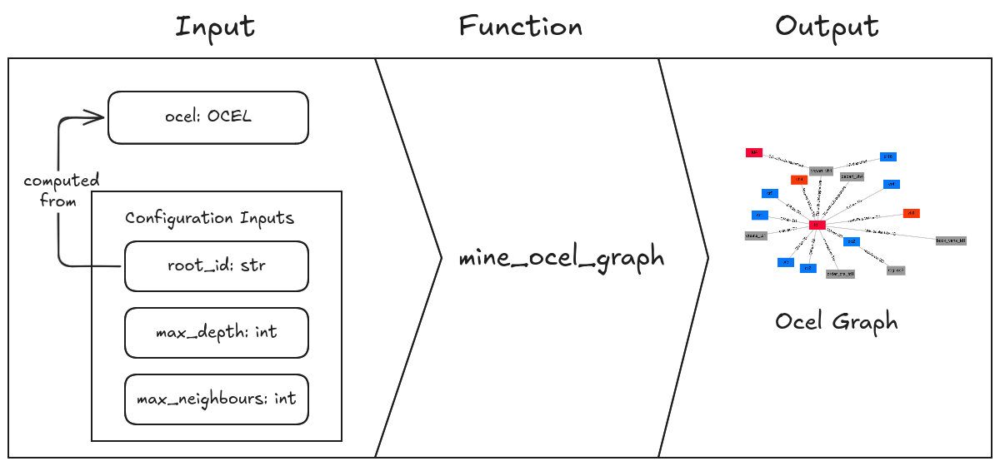

# Tutorial: OCEL Graph

This tutorial provides a general example for developing an Ocelescope plugin from scratch.

In this tutorial, we will build an **OCEL Graph** inspired by the OCELGraph feature of the [OCPQ](https://ocpq.aarkue.eu/) tool.

An **OCEL graph** visualizes how objects and events are related to each other. The plugin lets you choose an object or event ID as the starting point (the root), and then builds a spanning tree from that root based on the connected relationships in the ocel. You can also set how far the graph should expand from the starting point.

<div class="grid" markdown>
<figure markdown="span">
  
  <figcaption align="center">The input of the OCEL Graph</figcaption>
</figure>
<figure markdown="span">
  
  <figcaption align="center">The output of the OCEL Graph</figcaption>
</figure >
</div>

!!! tip "Try out OCELGraph"

    You can explore the source code in the repository below, or download the plugin and try it out yourself.

    <div style="display: flex; gap: 1rem; justify-content: start;" markdown>
    [:material-download: **Download**](https://github.com/Grkmr/OcelGraph/releases/download/v1.0.2/OcelGraphDiscovery.zip)
    [:simple-github: **Source**](https://github.com/Grkmr/ocelgraph)
    </div>

!!! requirements
    This project requires Python 3.13 to be installed on your system. For easy and reproducible package management, we recommend using [uv]("https://docs.astral.sh/uv/").

## Step 1: Setup

To get started, use the plugin template. Clone it like this:

```sh
git clone https://github.com/promi4s/plugin-template.git
cd plugin-template
```

Now install the dependencies:

```sh
uv sync
```

If you do not want to use uv, you can use any other Python package manager. For example, with pip you can run:

```sh
pip install -r requirements.txt
```

After that, your project should look similar to this:

```text
plugin-template/
├── src/
│   └── plugin-template/
│       ├── __init__.py
│       └── plugin.py
├── LICENSE
├── README.md
├── pyproject.toml
├── requirements.txt
└── uv.lock
```

The template is a minimal example. Most of your work will happen in `plugin.py`.

## Step 2: Writing the Plugin

### Writing Plugin Metadata

An Ocelescope plugin is defined by its Plugin Class. Let's start by adding some metadata to it.

Open ``plugin.py``, find the plugin class, and rename the class and its metadata to something like the following:

```python title="src/plugin-template/plugin.py"
class OcelGraphDiscovery(Plugin):
    label = "OCEL Graph"
    description = "Generate your own OCEL Graph"
    version = "0.1.0"
    ...
```

- The class name (OcelGraphDiscovery) is the unique name of your plugin and is used to distinguish it from other plugins.
- The label is what will be shown in the UI.
- The description briefly explains what your plugin does.
- The version field lets you update your plugin with new features or bug fixes over time.

### Adding a Plugin Method

Now let’s start writing the actual script that processes an OCEL and generates an OCEL Graph.

Add a new method to your plugin class called ``mine_ocel_graph``. Every plugin method should be decorated with [``@plugin_method``](../references/plugins/index.md#ocelescope.plugin.plugin_method), where you can specify a label and a description. These will be displayed in the frontend interface.

```python title="src/plugin-template/plugin.py"
class OcelGraphDiscovery(Plugin):
    @plugin_method(label="Mine OCEL Graph", description="Mines a ocel graph")
    def mine_ocel_graph(
        self,
    ):
        pass
```

### Planning a Plugin Method

When writing a plugin method, it’s always important to think beforehand about its inputs and outputs. For our OCEL Graph plugin, we need the following inputs:

- ocel: The OCEL to analyze.
- root_id: An identifier for the root of the graph. This can be either an object ID or an event ID from the OCEL log.
- max_depth: The maximum depth to which the graph should be explored from the root entity.
- max_neighbours: The maximum number of neighbours to include at each step, to prevent the graph from growing too large and becoming unmanageable.

As an output, our method will return an OCEL graph. Since plugin methods in Ocelescope can only return either OCELs or Resources, the OCEL Graph must be implemented as a resource.

<figure markdown="span">
  {width="600"}
</figure>

#### Adding an OCEL Input

Since our goal is to create an OCEL Graph, we need to have an OCEL as one of the method inputs. This can be done by simply adding it as a parameter to the `mine_ocel_graph` method:

```python title="src/plugin-template/plugin.py"
from ocelescope import OCEL
...
  @plugin_method(label="Mine OCEL Graph", description="Mines a ocel graph")
  def mine_ocel_graph(self, ocel: OCEL):
      pass
```

To make it easier for users in the UI, you can give this input a prettier name and a helpful description. You do this by annotating the parameter with the [`OCELAnnotation`](../references/plugins/index.md#ocelescope.plugin.OCELAnnotation) class:

```python title="src/plugin-template/plugin.py"
def mine_ocel_graph(
    self,
    ocel: Annotated[
        OCEL,
        OCELAnnotation(
            label="Event Log",
            description="The log from which the OCEL graph should be mined",
        ),
    ],
):
    pass
```

Now, in the UI, users will see a friendly label and description when selecting the OCEL input for your plugin.

#### Adding a Configuration Input

To add the other inputs of the mine_ocel_graph function we define a [configuration input](../plugins/plugin_class.md#configuration-inputs) class.  

Lets create a new file called (`ìnput.py`), next to the plugin input that we could name to `OCELGraphInput` to match your plugin that inherits from the PluginInput of the ocelescope package.

```python title="src/plugin-template/input.py"
from ocelescope import PluginInput

class OCELGraphInput(PluginInput):
    pass
```

Now, extend your `OCELGraphInput` class to include configuration parameters for the **maximum depth** of the OCEL graph and the **maximum number of neighbours** per node.

Use [Pydantic’s `Field`](https://docs.pydantic.dev/latest/concepts/fields/) to set titles, descriptions, defaults, and constraints for these integer values.

```python title="src/plugin-template/input.py"
from pydantic import Field

class OCELGraphInput(PluginInput, frozen=True):
    depth: int = Field(
        title="OCEL Graph Depth",
        description="The maximum depth of the OCEL graph",
        default=3,
        gt=0,
        le=10
    )
    max_neighbours: int = Field(
        title="Maximum Neighbours",
        description="The maximum amount of neighbours a node can have",
        default=5,
        gt=0
    )
```

To let users select the root entity of the OCEL graph, define two classes:

- `ObjectRoot` for selecting an object by its ID  
- `EventRoot` for selecting an event by its ID  

Each class uses the [`OCEL_FIELD`](../references/plugins/index.md#ocelescope.plugin.OCEL_FIELD) helper to link the field to the selected OCEL log, enabling autocomplete and validation in the UI.

!!! important
    The `ocel_id` argument in `OCEL_FIELD` must exactly match the name of the OCEL parameter in your plugin method  
    (for example, `ocel` in `def mine_ocel_graph(self, ocel: OCEL, ...)`).  
    This ensures that the field is correctly linked to the user-selected OCEL log and will display the appropriate dropdown/autocomplete values.

```python title="src/plugin-template/input.py"
from pydantic import BaseModel
from ocelescope import OCEL_FIELD

class ObjectRoot(BaseModel):
    class Config:
        title = "Object" # Better readability in UI

    object_id: str = OCEL_FIELD(
        field_type="object_id",
        title="Object Id",
        ocel_id="ocel",
        description="The ID of the Object which is the root of the OCEL Graph",
    )

class EventRoot(BaseModel):
    class Config:
        title = "Event" # Better readability in UI

    event_id: str = OCEL_FIELD(
        field_type="event_id",
        title="Event Id",
        ocel_id="ocel",
        description="The ID of the Event which is the root of the OCEL Graph",
    )
```

These classes are then combined in your main input class using a **union** type (`ObjectRoot | EventRoot`):

```python title="src/plugin-template/input.py"
class OCELGraphInput(PluginInput, frozen=True):
    root: ObjectRoot | EventRoot
    ...
```

??? example "Final Input Code"

    ```python title="src/plugin-template/input.py"
    from ocelescope import OCEL_FIELD, PluginInput
    from pydantic import BaseModel, Field


    class ObjectRoot(BaseModel):
        class Config:
            title = "Object"

        object_id: str = OCEL_FIELD(
            field_type="object_id",
            title="Object Id",
            ocel_id="ocel",
            description="The ID of the Event which is the root of the OcelGraph",
        )


    class EventRoot(BaseModel):
        class Config:
            title = "Event"

        event_id: str = OCEL_FIELD(
            field_type="event_id",
            title="Event Id",
            ocel_id="ocel",
            description="The ID of the Event which is the root of the OcelGraph",
        )


    class OCELGraphInput(PluginInput):
        root: ObjectRoot | EventRoot
        depth: int = Field(
            title="OCEL Graph Depth", description="The maximum depth of the ocel graph", default=3, gt=0, le=10
        )
        max_neighbours: int = Field(
            title="Maximum Neighbours", description="The maximum amount of neighbours a node can have", gt=0, default=5
        )
    ```

    This code creates the following input form in the frontend:

    

#### Adding the Configuration Input to the plugin method

Now let's add the input class method to our plugin method.

```python title="src/plugin-template/plugin.py"
from .input import OCELGraphInput

class OcelGraphDiscovery(Plugin):

    @plugin_method(label="Mine OCEL Graph", description="Mines a OCEL Graph")
    def mine_ocel_graph(
        self,
        ocel: Annotated[
            OCEL,
            OCELAnnotation(label="Event Log", description="The log from which the ocel graph should be mined from"),
        ],
        input: OCELGraphInput,
    ):
        ...
```

### Defining a Resource

After we defined out Inputs now lets define our output. We want to define a custom output—an OCEL Graph—which in Ocelescope is done by creating a Python class that inherits from the `Resource` class. Let's also create it in a new file called `resource.py` next to the `plugin.py` file.

```python title="src/plugin-template/resource.py"
from ocelescope import Graph, GraphEdge, GraphNode, GraphvizLayoutConfig, Resource, generate_color_map
from pydantic import BaseModel


class EventNode(BaseModel):
    id: str
    activity: str


class ObjectNode(BaseModel):
    id: str
    object_type: str


class Relation(BaseModel):
    qualifier: str
    source: str
    target: str
    object_type: str | None = None


class OCELGraph(Resource):
    label = "Ocel Graph"
    description = "A Ocel graph"

    events: list[EventNode] = []
    objects: list[ObjectNode] = []
    relations: list[Relation] = []


```

!!! important
    All subclasses used as properties in your resource (such as `EventNode`, `ObjectNode`, `Relation`, `O2ORelation`, and `E2ORelation`) should inherit from Pydantic’s `BaseModel`.  
    This ensures that your data structures are compatible with Ocelescope’s validation and serialization.

A resource can include any property that can be serialized to JSON—such as lists, strings, numbers, or other `BaseModel` classes.

You can also add any number of functions to work with the resource. For example, here’s how to get all event and object IDs inside the resource:

```python title="src/plugin-template/resource.py"
class OCELGraph(Resource):

    ...

    @property
    def event_ids(self) -> list[str]:
        return [event.id for event in self.events]

    @property
    def object_ids(self) -> list[str]:
        return [object.id for object in self.objects]
```

To tell Ocelescope that your method returns your `OCELGraph`, add it as a type hint in your plugin method:

```python title="src/plugin-template/resource.py"
from .resource import OCELGraph

class OcelGraphDiscovery(Plugin):
    ...
    @plugin_method(label="Mine OCEL Graph", description="Mines an OCEL Graph")
    def mine_ocel_graph(...) -> OCELGraph:
        ...
```

#### Visualization

At this point, our `OCELGraph` class can already be used as a resource and returned as an output from your plugin method. However, by default, it is just a data structure without any built-in visualization.

To enable visualization in the Ocelescope frontend, you can extend your resource class by adding a `visualize` method.  
A visualization function is a class method that returns a predefined visualization object (such as a `Graph`), and should include a type hint for clarity.

For example, you can add the following `visualize` method to your `OCELGraph` class:

```python title="src/plugin-template/resource.py"
from ocelescope import Resource
from ocelescope.visualization import Graph, GraphEdge, GraphvizLayoutConfig
from ocelescope.visualization.default.graph import GraphNode
from ocelescope.visualization.util.color import generate_color_map

...

class OCELGraph(Resource):
    ...

    def visualize(self) -> Graph:
        color_map = generate_color_map(list(set([object.object_type for object in self.objects])))

        object_nodes = [
            GraphNode(
                id=object_node.id, shape="rectangle", label=object_node.id, color=color_map[object_node.object_type]
            )
            for object_node in self.objects
        ]

        event_nodes = [GraphNode(id=event.id, shape="rectangle", label=event.id) for event in self.events]

        edges = [
            GraphEdge(
                source=edge.source,
                target=edge.target,
                label=edge.qualifier,
                color=color_map[edge.object_type] if edge.object_type else None,
            )
            for edge in self.relations
        ]

        return Graph(
            type="graph",
            nodes=object_nodes + event_nodes,
            edges=edges,
            layout_config=GraphvizLayoutConfig(engine="neato", graphAttrs={"overlap": "prism"}),
        )
```

With this method, your resource will not only provide the OCEL graph data, but also a built-in visualization for the Ocelescope frontend to display.


??? example "Final OCELGraph Resource"

```python title="src/plugin-template/resource.py"
from ocelescope import Graph, GraphEdge, GraphNode, GraphvizLayoutConfig, Resource, generate_color_map
from pydantic import BaseModel


class EventNode(BaseModel):
    id: str
    activity: str


class ObjectNode(BaseModel):
    id: str
    object_type: str


class Relation(BaseModel):
    qualifier: str
    source: str
    target: str
    object_type: str | None = None


class OCELGraph(Resource):
    label = "Ocel Graph"
    description = "A Ocel graph"

    events: list[EventNode] = []
    objects: list[ObjectNode] = []
    relations: list[Relation] = []

    @property
    def event_ids(self) -> list[str]:
        return [event.id for event in self.events]

    @property
    def object_ids(self) -> list[str]:
        return [object.id for object in self.objects]

    def visualize(self) -> Graph:
        color_map = generate_color_map(list(set([object.object_type for object in self.objects])))

        object_nodes = [
            GraphNode(
                id=object_node.id, shape="rectangle", label=object_node.id, color=color_map[object_node.object_type]
            )
            for object_node in self.objects
        ]

        event_nodes = [GraphNode(id=event.id, shape="rectangle", label=event.id) for event in self.events]

        edges = [
            GraphEdge(
                source=edge.source,
                target=edge.target,
                label=edge.qualifier,
                color=color_map[edge.object_type] if edge.object_type else None,
            )
            for edge in self.relations
        ]

        return Graph(
            type="graph",
            nodes=object_nodes + event_nodes,
            edges=edges,
            layout_config=GraphvizLayoutConfig(engine="neato", graphAttrs={"overlap": "prism"}),
        )
```

### Implementing the Plugin Method

Now let's add the method which transforms our input (the OCEL and configuration) and returns our resource. For the sake of this tutorial, we won’t discuss the implementation details. Instead, we’ll add the implementation in a utility file to keep the plugin method itself clean and readable.

Download the [util.py]("../assets/ocelGraphTutorial/util.py") and add it next to the plugin.py

In your plugin class, simply import and call this function:

```python
from .util import mine_ocel_graph

class OcelGraphDiscovery(Plugin):
    ...
    @plugin_method(label="Mine OCEL Graph", description="Mines a OCEL Graph")
    def mine_ocel_graph(self, ocel: OCEL, input: OCELGraphInput) -> OCELGraph:
        return mine_ocel_graph(ocel, input)
```

!!! warning

    Currently, **Ocelescope plugins only support relative imports**.  
    This means you must ensure all imports inside your plugin use relative paths.

    ```python  title="src/plugin-template/plugin.py"
    # ✅ Correct (relative import)
    from .input import OCELGraphInput
    from .resource import OCELGraph
    from .util import mine_ocel_graph

    # ❌ Incorrect (absolute import)
    from plugin_template.input import OCELGraphInput
    from plugin_template.resource import OCELGraph
    from plugin_template.util import mine_ocel_graph
    ```

## Step 3: Build Plugin

Before your plugin can be built, make sure that the top-level `__init__.py` properly exposes your plugin class:

```python title="__init__.py"

from .plugin import OcelGraphDiscovery

__all__ = [
    "OcelGraphDiscovery",
]
```

In ocelescope plugins are basically just the packages zipped so in our case:

```

plugin.zip
 └ocel_graph/
  ├── __init__.py
  ├── util.py
  ├── input.py
  ├── resource.py
  └── plugin.py
```

You can create the zip manually, or use the build command of the ocelescope library by running at the project root:

```sh
ocelescope build
```

Or if you are using uv:

```sh
uv run ocelescope build
```

The build script also checks for any absolute imports you may have missed and will raise an error if it finds them.
After running the build, your plugin package will be created in the dist/ folder.
